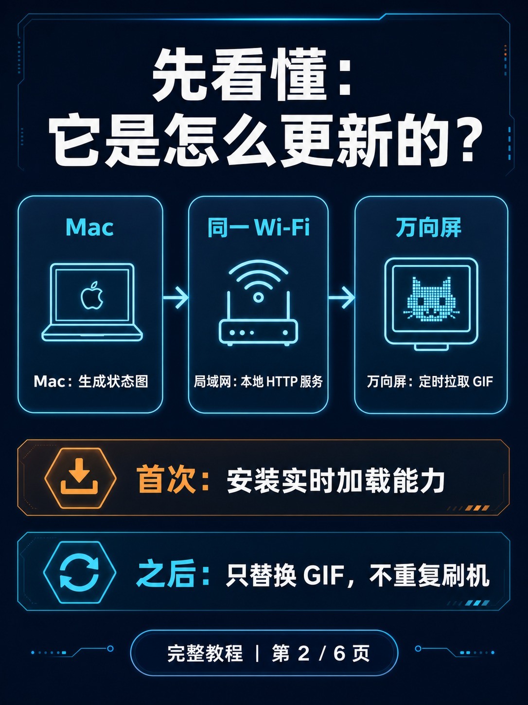
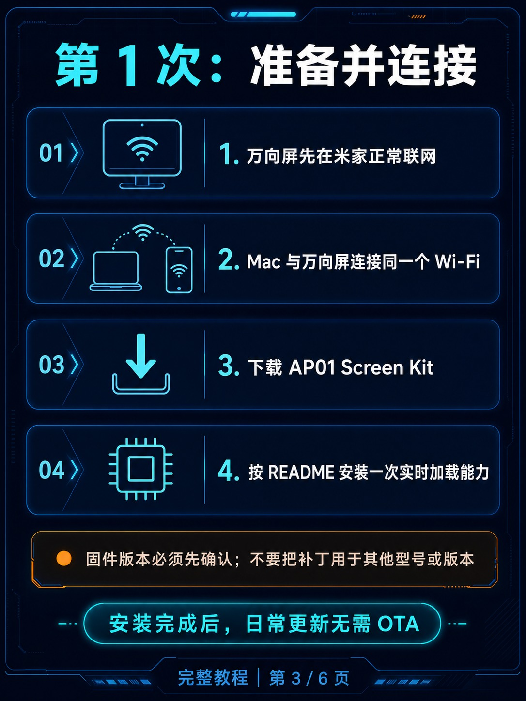
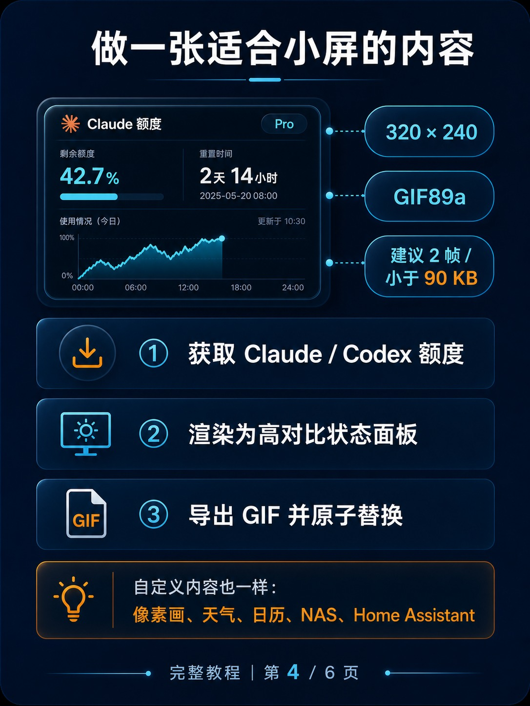
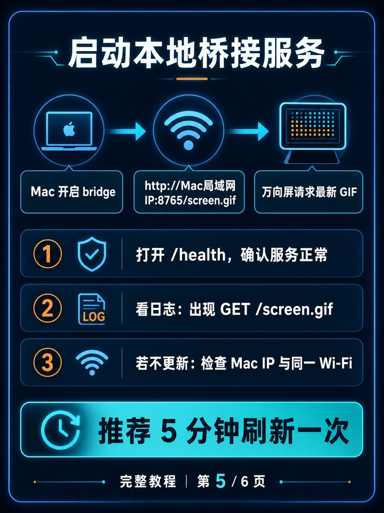
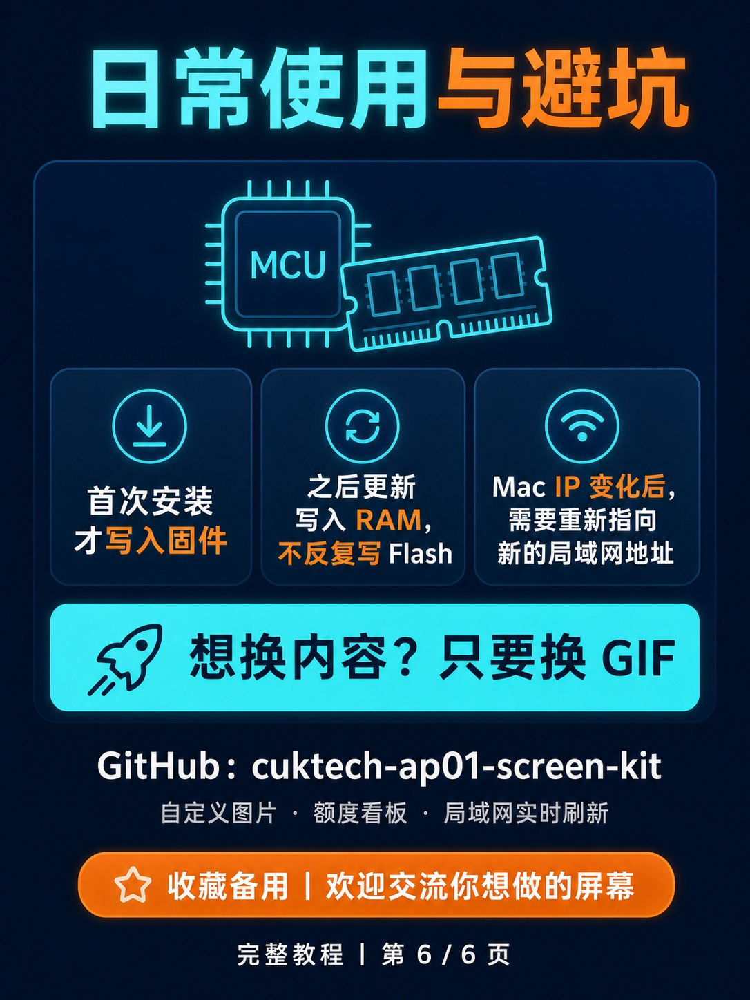

# AP01 Wi-Fi 实时信息屏：六页图文教程

这组图片适合快速了解项目，也可按顺序用于社交平台分享。涉及固件版本、
FDS 上传与命令参数时，请以项目根目录的
[中文 README](../README.zh-CN.md) 为准。

## 01 · 项目效果

## 02 · 更新链路

## 03 · 首次准备

## 04 · 制作小屏内容

## 05 · 启动本地 Bridge

## 06 · 日常更新与避坑

